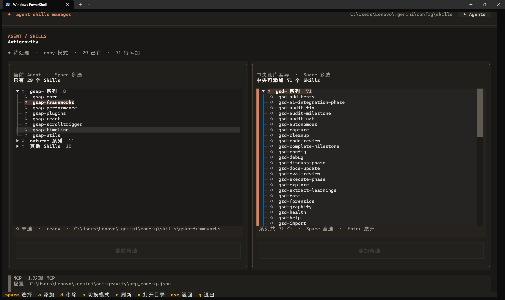
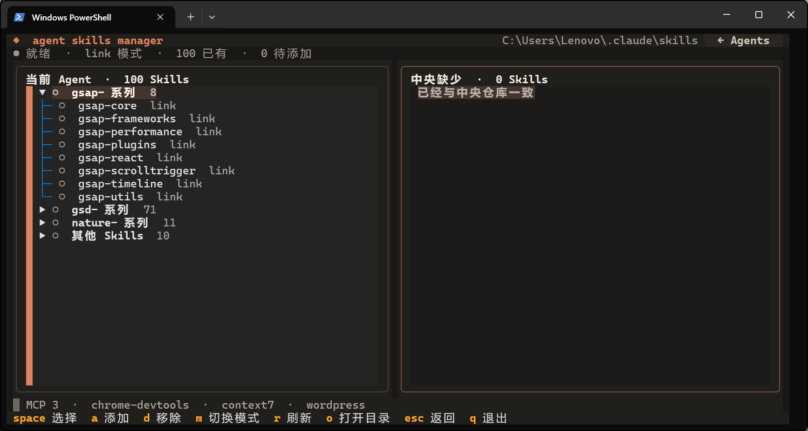
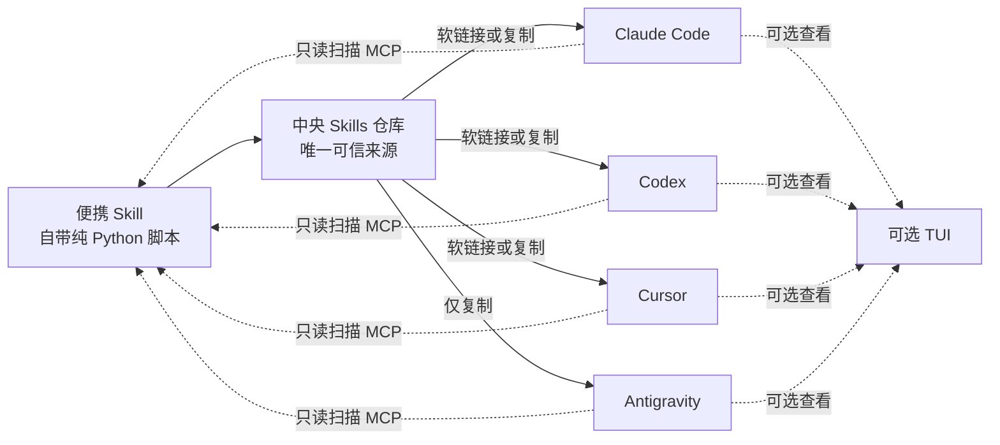

# Agent Skills Manager

> 只复制一个自带脚本的 Skill，就能让 Agent 管理散落在 Claude Code、Codex、Cursor 和 Antigravity 里的 Skills；需要时再安装漂亮的 TUI 随时查看。

[](https://www.python.org/)
[](https://docs.astral.sh/uv/)
[](https://textual.textualize.io/)
[](#支持范围)

如果你同时使用几个 AI 编程 Agent，大概见过这样的场面：

- 同一个 Skill 在四个目录里各放一份；
- 更新一次说明文件，要手动复制四遍；
- 想不起某个 MCP 到底配置在哪个 Agent 里；
- 换电脑后，只能凭记忆一点点恢复环境。

Agent Skills Manager 就是为这件事准备的。它是一个**管理 Skills 的 Skill**，还有精美的 **TUI 界面**，它坚持一个简单思路：

> **Skills 集中管理，Agent 按需同步；MCP 清楚展示，修改保持谨慎。**

## 实机效果

下面是 Agent Skills Manager 在 Windows Terminal 中的真实运行效果，没有使用设计稿或模拟数据。



*全屏模式：左侧管理当前 Agent，右侧查看中央仓库中可以添加的 Skills；同前缀 Skill 会自动聚合成系列。*



*紧凑模式：小窗口会收起大按钮和次要说明，继续使用 `Space` 多选、`A` 添加、`D` 移除。*

## 30 秒了解它



中央仓库默认位于你的用户目录：

```text
~/.agent/skills/
├── my-code-review-skill/
│   └── SKILL.md
├── frontend-design/
│   └── SKILL.md
└── another-useful-skill/
    └── SKILL.md
```

你只维护这里的 Skills，管理器负责把它们送到各个 Agent。

## 功能亮点

- 🧰 **中央 Skills 仓库**：一处维护，多处使用。
- 📦 **Skill 自带脚本**：复制目录即可使用，不依赖本项目安装或第三方 Python 包。
- 🖥️ **可选现代 TUI**：不用记住所有目录，一眼查看四个 Agent。
- 🔗 **两种同步方式**：每个 Agent 可选择软链接或复制。
- 📥 **首次导入**：把 Agent 中已有、尚未纳管的 Skill 复制到中央仓库。
- 👀 **先预览再执行**：内嵌脚本默认只输出计划，显式 `--apply` 才写文件。
- 🛟 **替换前备份**：更新不同版本时，旧目录会带时间戳保存下来。
- 🔍 **MCP 只读盘点**：显示已发现的 MCP，不擅自修改配置。
- 🪟🍎 **跨平台**：面向 Windows 与 macOS，路径通过配置定义。

## 支持范围

| Agent | 默认 Skills 目录 | 默认 MCP 配置 | 同步方式 |
|---|---|---|---|
| Claude Code | `~/.claude/skills` | `~/.claude.json` | 复制 / 软链接 |
| Codex | `~/.codex/skills` | `~/.codex/config.toml` | 复制 / 软链接 |
| Cursor | `~/.cursor/skills` | `~/.cursor/mcp.json` | 复制 / 软链接 |
| Antigravity | `~/.gemini/config/skills` | `~/.gemini/antigravity/mcp_config.json` | **仅复制** |

> [!NOTE]
> "未安装"不一定代表程序判断错了。如果某个 Agent 从未创建过 Skills 或 MCP 目录，管理器也会把它标记为未安装。

## 安装 Skill（让 Agent 帮你完成）

便携 Skill 只要求系统有 **Python 3.9+**，只使用标准库，不需要 `pip install` 或任何第三方包。

**最简单的方式：让 AI Agent 帮你安装。** 在任意已支持的 Agent 中说：

```text
请帮我安装 agent-skills-manager Skill。
仓库地址：https://github.com/ccckfg/agent-skills-manager
把 skill/agent-skills-manager 目录复制到你的 Skills 目录即可。
```

Agent 会自动克隆仓库、定位目录并完成安装。

如果你更喜欢手动操作，只需两步：

1. 克隆仓库：`git clone https://github.com/ccckfg/agent-skills-manager.git`
2. 把 `skill/agent-skills-manager/` 整个目录复制到目标 Agent 的 Skills 目录（见[支持范围](#支持范围)表格）。

安装完成后，重新打开 Agent，直接说：

```text
使用 agent-skills-manager 检查我本地所有 Agent 的 Skills 和 MCP。
```

> [!IMPORTANT]
> "只复制即可使用"不等于完全不需要运行环境：电脑仍需有 Python 3.9+，并且 Agent 必须拥有本地终端执行权限。

## 可选安装：TUI 界面

内嵌脚本面向 Agent，TUI 面向人。你希望随时打开漂亮的总览界面时，再安装 TUI 即可。

**同样可以让 AI Agent 帮你安装。** 在 Agent 中说：

```text
请帮我安装 agent-skills-manager 的 TUI。
需要先确保系统有 uv（https://docs.astral.sh/uv/），然后执行：
uv tool install git+https://github.com/ccckfg/agent-skills-manager.git
```

安装完成后运行 `agent-skills-manager init` 初始化，再运行 `agent-skills-manager` 打开 TUI。

如需手动安装，请确保系统已有 [uv](https://docs.astral.sh/uv/getting-started/installation/)，然后：

```shell
uv tool install git+https://github.com/ccckfg/agent-skills-manager.git
agent-skills-manager init
agent-skills-manager
```

需要参与开发时，也可以克隆仓库后运行 `uv sync`，再使用 `uv run agent-skills-manager`。

## TUI 怎么操作？

TUI 会先显示界面，再在后台快速扫描本机目录。方向键选择 Agent，按 `Enter` 后会看到两个可滚动面板：

- 左侧是这个 Agent 当前已有的 Skills；
- 右侧是中央仓库有、但这个 Agent 还没有的 Skills；
- `gsd-`、`gsap-` 这类共享固定前缀的 Skills 会自动折叠成系列，并可整组选中；
- `.system` 等点号开头的隐藏目录不会进入管理清单。

用 `Tab` 在左右面板与按钮之间移动焦点，用方向键浏览，`Enter` 展开分组，`Space` 选择当前 Skill 或整个系列。可以连续选择多个 Skill 或多个系列，再一次完成添加或移除。`○` 表示未选，`●` 表示已选，`◐` 表示系列中只选了一部分。

当终端高度较小时，TUI 会自动进入紧凑模式：隐藏操作按钮和选择提示，把更多空间留给 Skills 列表；极小窗口还会收起 MCP 与次要状态。重新放大窗口后会恢复完整布局，当前选择不会丢失。

| 按键 | 作用 |
|---|---|
| `Enter` | 打开选中 Agent；在详情页展开或收起分组 |
| `Space` | 选中/取消当前 Skill；停在系列节点时切换整个系列 |
| `A` | 把右侧所有已选 Skills 添加到当前 Agent |
| `D` / `Delete` | 从当前 Agent 移除左侧所有已选 Skills |
| `Esc` | 返回总览 |
| `R` | 重新扫描本地环境 |
| `M` | 在 Copy 与 Link 之间切换 |
| `O` | 在文件管理器中打开 Skills 目录 |
| `Q` | 退出 |

> [!IMPORTANT]
> 添加和移除都会先显示确认框。移除不是永久删除：原目录会移动到 `~/.agent/backups/<agent-id>/`。Antigravity 不支持软链接，按 `M` 不会切换到 Link。

## Copy 和 Link 应该选哪个？

### Copy：更稳妥的复印件

管理器把中央仓库里的 Skill 完整复制到 Agent 目录。

优点：

- Windows 和 macOS 都容易理解；
- Agent 看见的是普通文件夹；
- 不依赖软链接权限；
- 适合 Antigravity。

代价是中央 Skill 更新后，需要再同步一次。

### Link：始终指向中央仓库的快捷通道

Agent 目录里放的是指向中央 Skill 的软链接。

优点是修改中央文件后通常立即生效，也更节省空间。

注意事项：

- Windows 会使用目录 Junction，通常不要求开启"开发者模式"；macOS 使用目录软链接；
- 移动或删除中央仓库会让链接失效；
- 某些 Agent 或沙箱环境不接受软链接；
- Antigravity 在本项目中固定使用 Copy。

拿不准时，**选择 Copy**。

## 文件发生冲突时会怎样？

同步遵守三条原则：

1. Agent 中与中央仓库一致的 Skill 不重复处理；
2. Agent 独有且尚未纳管的 Skill 不会在普通同步中被删除；
3. 需要替换不同版本时，旧目录先改名备份。

便携脚本会把备份集中放在 `~/.agent/backups/<agent>/`。备份名称类似：

```text
my-skill.agent-skills-manager-backup-20260721123456789000
```

确认新版本正常后，你可以自行归档或删除旧备份。管理器不会偷偷替你清理。

## 配置文件

执行 `init` 后，终端会打印配置文件的准确位置。不同系统的位置由系统规范决定，不需要死记。

内容类似：

```yaml
central_skills_path: C:\Users\you\.agent\skills
agents:
  antigravity:
    enabled: true
    skills_mode: copy
  claude-code:
    enabled: true
    skills_mode: copy
  codex:
    enabled: true
    skills_mode: link
  cursor:
    enabled: true
    skills_mode: copy
```

你也可以临时使用另一份配置：

```shell
agent-skills-manager --config ./my-settings.yaml status
```

这很适合区分"工作环境"和"个人环境"。

## MCP 为什么只读？

因为 MCP 配置不像复制普通文件那么简单。里面可能有：

- API Key 和访问令牌；
- 本地可执行命令；
- 工作目录；
- 环境变量；
- JSON、JSONC、TOML 等不同格式；
- Agent 自己的注释和扩展字段。

自动重写稍有不慎就可能丢注释、泄露秘密或破坏整个配置。因此当前应用只盘点 MCP Server 名称。

需要修改时，可使用仓库中的配套 Skill。它会指导 Agent：

1. 找准目标 Agent 和配置文件；
2. 读取现有配置；
3. 展示最小差异；
4. 创建时间戳备份；
5. 只修改目标区块；
6. 校验格式；
7. 再次读取并汇报结果。

也就是说，**程序负责看清楚，Agent 负责解释和谨慎操作，最终决定权仍在你手里。**

## 常见问题

### 1. 为什么某个 Agent 显示 `Needs attention`？

常见原因包括：

- 中央仓库有 Skill，但该 Agent 还没同步；
- Agent 中的副本与中央版本不同；
- 软链接已经失效；
- Agent 中存在尚未导入中央仓库的 Skill。

先运行 `status`，再使用 `import --dry-run` 或 `sync --dry-run` 判断是哪一种情况。

### 2. Windows 创建软链接失败怎么办？

最省心的方案是在 TUI 中按 `M` 切回 Copy。你也可以开启 Windows 开发者模式，再重新尝试 Link。

### 3. MCP 数量为什么是 0？

可能是：

- 该 Agent 确实没有配置 MCP；
- 配置文件尚未创建；
- 配置使用了当前版本尚未识别的结构；
- Agent 更新后更换了默认路径或格式。

请先确认表格中的默认路径是否与你的实际安装一致，再提交 Issue。

### 4. 导入时提示重名并跳过

这是一项保护措施。两个 Agent 中同名 Skill 可能内容不同，程序不会擅自替你决定保留哪一个。请手动比较后改名，或明确整理中央版本，再重新扫描。

### 5. 我能直接编辑中央仓库吗？

可以。中央仓库就是普通文件夹。编辑完成后建议运行 `sync --dry-run` 确认差异符合预期，再执行同步。

## 项目结构

```text
agent-skills-manager/
├── src/agent_skills_manager/
│   ├── adapters/        # Agent 定义与注册表
│   ├── config/          # 用户设置的加载与保存
│   ├── domain/          # 核心数据模型
│   ├── infrastructure/  # 文件、Skill 仓库和 MCP 读取
│   ├── resources/       # 默认 Agent 路径配置
│   ├── services/        # 扫描、导入和同步业务逻辑
│   ├── tui/             # Textual 终端界面
│   └── cli.py           # 命令行入口
├── skill/
│   └── agent-skills-manager/
│       ├── SKILL.md       # Agent 工作流与安全规则
│       ├── scripts/       # 无第三方依赖的便携管理脚本
│       └── references/    # 命令及各 Agent 配置参考
├── tests/               # 自动化测试
├── pyproject.toml       # 项目与依赖配置
└── uv.lock              # 可复现依赖锁文件
```

项目严格区分 UI、业务逻辑、Agent 适配、配置和文件操作，方便以后增加新 Agent，而不是把所有逻辑塞进一个文件。

## 开发与测试

克隆项目后：

```shell
uv sync
uv run pytest -q
uv run ruff check .
uv run ruff format --check .
```

构建发行包：

```shell
uv build
```

## 当前安全边界

- 同步对象仅限 Skill 目录；
- MCP 在应用中只读；
- 不自动写入 API Key、令牌或其他秘密；
- 不删除 Agent 独有的未纳管 Skill；
- 替换已有 Skill 前在 `~/.agent/backups/<agent>/` 创建集中备份；
- 内嵌脚本的 `import` 和 `sync` 默认只展示计划；
- 内嵌脚本只有显式传入 `--apply` 才写文件；
- 可选 CLI 默认需要终端确认；TUI 的单项添加和移除也必须经过确认框。

在执行任何批量同步前，仍建议把重要配置纳入 Git 或自己的备份系统。

## 路线图

- [ ] TUI 同步前展示可确认的差异计划
- [ ] 在界面中完成首次导入
- [ ] 支持自定义 Agent 与自定义路径
- [ ] Skills 冲突的可视化比较
- [ ] 中央仓库的 Git 备份与更新提示
- [ ] 更完善的 macOS 实机测试
- [ ] MCP 配置的结构化只读详情

## 参与贡献

欢迎提交 Issue、功能建议和 Pull Request。

如果你想新增一个 Agent，请尽量同时提供：

1. 官方产品名称；
2. Windows 与 macOS 默认 Skills 路径；
3. MCP 配置路径和格式；
4. 是否支持软链接；
5. 不包含秘密信息的示例配置；
6. 对应测试。

描述 Bug 时，建议附上操作系统、Python/uv 版本、执行命令和已隐藏隐私信息的错误输出。

---

如果这个项目让你的 AI 工具箱少了一点混乱、多了一点秩序，欢迎点一个 Star，也欢迎告诉我你最希望接下来支持哪个 Agent。✨
